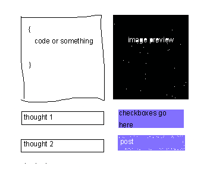

# code tweeter

I want a way to tweet a tweet about code in a way that's easy. It should: 

1. Generate the code image appear and look good
2. Automatically create the thread thingies
3. Make hashtags or something idk
4. Be configurable to add the same post to other social media platforms like GitHub lol

## Requirements

1. A user interface that can be opened via command prompt that allows me to create my post and automagically preview the code images
2. The option to tweet but also go to other platforms in like a checkmarky dialog thing
3. Thoughts that turn into paragraphs or tweets or whatever based on the platforms

